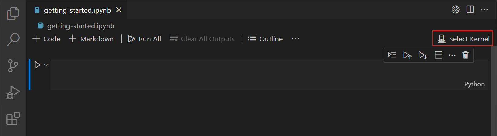
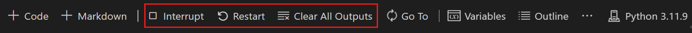

+++
title = 'Jupyter'
draft = false
weight = 184
+++

## Blocs-notes Jupyter dans VS Code

Jupyter (anciennement IPython Notebook) est un projet open source qui vous permet de combiner facilement du texte Markdown et du code source Python exécutable sur un canevas appelé notebook.   
Visual Studio Code prend en charge l’utilisation des blocs-notes Jupyter en mode natif et via des fichiers de code Python. 

- Créer, ouvrir et enregistrer des blocs-notes Jupyter
- Utiliser des cellules de code Jupyter
- Afficher, inspecter et filtrer les variables à l’aide de l’Explorateur de variables et de la visionneuse de données
- Se connecter à un serveur Jupyter distant
- Déboguer un bloc-notes Jupyter

## Configuration de votre environnement

Pour utiliser Python dans Jupyter Notebooks, vous devez activer un environnement Anaconda dans VS Code ou un autre environnement Python dans lequel vous avez installé le package Jupyter. Pour sélectionner un environnement, utilisez la commande Python : Sélectionner un interpréteur dans la palette de commandes (`Ctrl+Maj+P`).

Une fois l’environnement approprié activé, vous pouvez créer et ouvrir un bloc-notes Jupyter, vous connecter à un serveur Jupyter distant pour exécuter des cellules de code et exporter un bloc-notes Jupyter sous forme de fichier Python.

## Approbation de l’espace de travail

Lorsque vous commencez à utiliser Jupyter Notebooks, vous devez vous assurer que vous travaillez dans un espace de travail approuvé. Du code nuisible peut être incorporé dans des blocs-notes et la fonctionnalité d’approbation de l’espace de travail vous permet d’indiquer quels dossiers et leur contenu doivent autoriser ou restreindre l’exécution automatique de code.

Si vous tentez d’ouvrir un bloc-notes lorsque VS Code se trouve dans un espace de travail non approuvé exécutant le mode restreint, vous ne pourrez pas exécuter de cellules et les sorties enrichies seront masquées.

## Créer ou ouvrir un bloc-notes Jupyter

Vous pouvez créer un bloc-notes Jupyter en exécutant la commande **Créer** : un nouveau bloc-notes Jupyter à partir de la palette de commandes (`Ctrl+Maj+P`) ou en créant un fichier dans votre espace de travail.`.ipynb`

Ensuite, sélectionnez un noyau à l’aide du sélecteur de noyau en haut à droite.

Après avoir sélectionné un noyau, le sélecteur de langue situé en bas à droite de chaque cellule de code sera automatiquement mis à jour vers la langue prise en charge par le noyau.

Si vous disposez d’un bloc-notes Jupyter, vous pouvez l’ouvrir en cliquant avec le bouton droit sur le fichier et en l’ouvrant avec VS Code, ou via l’explorateur de fichiers VS Code.

## Cellules en cours d’exécution

### Exécuter une seule cellule de code

Une fois votre code ajouté, vous pouvez exécuter une cellule à l’aide de l’icône Exécuter à gauche de la cellule et la sortie sera affichée sous la cellule de code.

Pour exécuter une cellule de code sélectionnée, vous pouvez également utiliser des raccourcis clavier en mode commande et en mode édition. 
- `Ctrl+Entrée` exécute la cellule actuellement sélectionnée. 
- `Maj+Entrée` exécute la cellule actuellement sélectionnée et insère une nouvelle cellule juste en dessous (le focus se déplace vers la nouvelle cellule). 
- `Alt+Entrée` exécute la cellule actuellement sélectionnée et insère une nouvelle cellule juste en dessous (le focus reste sur la cellule actuelle).

### Exécuter plusieurs cellules de code

L’exécution de plusieurs cellules de code peut être accomplie de plusieurs façons. Vous pouvez utiliser la double flèche dans la barre d’outils principale de l’éditeur de bloc-notes pour exécuter toutes les cellules du bloc-notes ou en sélectionnant Exécuter tout, Exécuter tout au-dessus ou Exécuter tout en dessous au-dessus ou en dessous de la cellule de code actuelle. 

### Exécuter des cellules dans la section

Pour exécuter plus facilement des cellules associées dans un bloc-notes, vous pouvez exécuter des cellules regroupées par un en-tête de section Markdown avec l’action Exécuter les cellules dans la section. Cette action est disponible dans la vue Plan du bloc-notes et pour les éléments Sticky Scroll.

Dans les éléments Sticky Scroll, cliquez avec le bouton droit sur l’en-tête de votre choix et exécutez la section via l’action dans le menu contextuel. Dans la vue Plan, sélectionnez l’icône de barre d’outils qui apparaît au survol ou à la sélection, puis exécutez une seule cellule ou une section de cellules via les actions présentées.

[Vidéo: Exécuter des cellules](https://code.visualstudio.com/assets/docs/datascience/jupyter/notebook-run-in-section.mp4)

## Enregistrez votre bloc-notes Jupyter

Vous pouvez enregistrer votre bloc-notes Jupyter à l’aide du raccourci clavier `Ctrl+S` ou `Fichier > enregistrer`.

## Exporter votre bloc-notes Jupyter

Vous pouvez exporter un bloc-notes Jupyter sous forme de fichier Python, de fichier PDF ou de fichier HTML. Pour exporter, sélectionnez `... > Exporter` dans la barre d’outils principale. Une liste déroulante d’options de format de fichier vous est alors présentée.

**Note**: Pour l’exportation PDF, vous devez avoir installé TeX ([Installation Tex](https://nbconvert.readthedocs.io/en/latest/install.html#installing-tex)). Si vous ne le faites pas, vous serez averti que vous devez l’installer lorsque vous sélectionnerez l’option PDF. Sachez également que si vous avez une sortie SVG uniquement dans votre bloc-notes, elle ne sera pas affichée dans le PDF. Pour avoir des graphiques SVG dans un PDF, assurez-vous que votre sortie inclut un format d’image non SVG, ou bien vous pouvez d’abord exporter au format HTML, puis enregistrer au format PDF à l’aide de votre navigateur.

## Utiliser des cellules de code dans l’éditeur de bloc-notes

L’éditeur de bloc-notes facilite la création, la modification et l’exécution de cellules de code dans votre bloc-notes Jupyter.

### Créer une cellule de code

Par défaut, un bloc-notes vierge aura une cellule de code vide pour commencer et un bloc-notes existant en placera une en bas. Ajoutez votre code à la cellule de code vide pour commencer.

### Modes de cellule de code

Lorsque vous utilisez des cellules de code, une cellule peut être dans trois états : non sélectionné, mode commande et mode édition. Une barre verticale à gauche d’une cellule de code et de la bordure de l’éditeur indique l’état actuel d’une cellule. Lorsqu’aucune barre n’est visible, la cellule est désélectionnée. Lorsqu’une cellule est sélectionnée, elle peut être en mode commande ou en mode édition.

En mode commande, une barre verticale pleine apparaîtra à gauche de la cellule. La cellule peut être utilisée et accepte les commandes au clavier.

En mode édition, une barre verticale pleine est reliée par une bordure autour de l’éditeur de cellules. Le contenu de la cellule (code ou Markdown) peut être modifié.

Pour changer de mode, vous pouvez utiliser votre clavier ou votre souris. Sur votre clavier, appuyez sur la touche `Entrée` pour passer en mode édition ou sur la touche `Échap` pour passer en mode commande. Avec votre souris, cliquez sur la barre verticale à gauche de la cellule ou en dehors de la zone **code/Markdown** dans la cellule de code.

### Ajouter des cellules de code supplémentaires

Vous pouvez ajouter des cellules de code à l’aide de la barre d’outils principale, de la barre d’outils Ajouter une cellule (visible au survol) et des commandes clavier.

Pour ajouter une nouvelle cellule sous la cellule actuellement sélectionnée, utilisez l’icône plus dans la barre d’outils principale ou la barre d’outils de survol d’une cellule.

Lorsqu’une cellule de code est en mode commande, utilisez la touche A pour ajouter une cellule au-dessus et la touche B pour ajouter une cellule au-dessous de la cellule sélectionnée.

### Sélectionnez une cellule de code

Vous pouvez modifier une cellule de code sélectionnée à l’aide de la souris ou des touches fléchées haut/bas du clavier. Lorsqu’une cellule de code est en mode commande, vous pouvez également utiliser la touche `J` (bas) et la touche `K` (haut).

### Sélectionner plusieurs cellules de code

Pour sélectionner plusieurs cellules, commencez par une cellule en mode sélectionné. Un arrière-plan rempli indique les cellules sélectionnées. Pour sélectionner des cellules consécutives, maintenez la touche `Maj` enfoncée et cliquez sur la dernière cellule que vous souhaitez sélectionner. Pour sélectionner un groupe de cellules, maintenez la touche `Ctrl` enfoncée et cliquez sur les cellules que vous souhaitez ajouter à votre sélection.

### Déplacer une cellule de code

Vous pouvez déplacer des cellules vers le haut ou vers le bas dans un bloc-notes par glisser-déposer. Pour les cellules de code, la zone de glisser-déposer se trouve à gauche de l’éditeur de cellule, comme indiqué ci-dessous. Pour les cellules Markdown rendues, vous pouvez cliquer n’importe où pour faire glisser et déposer des cellules.

Pour déplacer plusieurs cellules, vous pouvez utiliser les mêmes zones de glisser-déposer dans n’importe quelle cellule incluse dans la sélection.

Le raccourci clavier `Alt+Flèche` déplace également une ou plusieurs cellules sélectionnées.

### Supprimer une cellule de code

Pour supprimer du code, vous pouvez utiliser l’icône Supprimer dans la barre d’outils de la cellule de code. Lorsque la cellule de code sélectionnée est en mode commande, vous pouvez utiliser le raccourci clavier `dd`.

### Annuler votre dernière modification

Vous pouvez utiliser la touche z pour annuler votre modification précédente, par exemple, si vous avez effectué une modification accidentelle, vous pouvez l’annuler à l’état correct précédent, ou si vous avez supprimé une cellule accidentellement, vous pouvez la récupérer.

### Basculer entre le code et Markdown

L’éditeur de bloc-notes vous permet de modifier facilement les cellules de code entre Markdown et le code. La sélection du sélecteur de langue en bas à droite d’une cellule vous permettra de basculer entre Markdown et, le cas échéant, toute autre langue prise en charge par le noyau sélectionné.

Vous pouvez également utiliser le clavier pour modifier le type de cellule. Lorsqu’une cellule est sélectionnée et en mode commande, la touche `M` bascule le type de cellule sur Markdown et la touche `Y` bascule le type de cellule sur code.

Une fois Markdown défini, vous pouvez entrer du contenu au format Markdown dans la cellule de code.

Pour afficher des cellules Markdown, vous pouvez cocher la barre d’outils de la cellule ou utiliser les raccourcis clavier `Ctrl+Entrée` et `Maj+Entrée`.

### Effacer la sortie ou redémarrer/interrompre le noyau

Si vous souhaitez effacer toutes les sorties de cellule de code ou redémarrer/interrompre le noyau, vous pouvez le faire à l’aide de la barre d’outils principale de l’éditeur de bloc-notes.

### Activer/désactiver les numéros de ligne

Lorsque vous êtes en mode commande, vous pouvez activer ou désactiver la numérotation des lignes dans une seule cellule de code à l’aide de la touche `L`.

Pour basculer la numérotation des lignes pour l’ensemble du bloc-notes, utilisez `Maj+L` en mode commande sur n’importe quelle cellule.

## Table des matières

Pour naviguer dans votre bloc-notes, ouvrez l’Explorateur de fichiers dans la barre d’activité. Ouvrez ensuite l’onglet **Plan** dans la barre latérale.

**Note**: Par défaut, le plan n’affichera que Markdown. Pour afficher les cellules de code, activez le paramètre suivant : `Contour du bloc-notes > : Afficher les cellules de code`.

## Prise en charge d’IntelliSense dans l’éditeur de bloc-notes Jupyter

La fenêtre Python Jupyter Notebook Editor contient des informations complètes sur IntelliSense : saisie semi-automatique du code, listes de membres, informations rapides sur les méthodes et conseils de paramètre. Vous pouvez être tout aussi productif en tapant dans la fenêtre de l’éditeur de bloc-notes que dans l’éditeur de code.

## Explorateur de variables et visionneuse de données

Dans un bloc-notes Python, il est possible d’afficher, d’inspecter, de trier et de filtrer les variables de votre session Jupyter actuelle. En sélectionnant l’icône **Variables** dans la barre d’outils principale après avoir exécuté le code et les cellules, vous verrez une liste des variables actuelles, qui seront automatiquement mises à jour au fur et à mesure que les variables sont utilisées dans le code. Le volet des variables s’ouvre en bas du bloc-notes.

### Visionneuse de données

Pour plus d’informations sur vos variables, vous pouvez également double-cliquer sur une ligne ou utiliser le bouton Afficher la variable dans la visionneuse de données en regard de la variable pour obtenir une vue plus détaillée d’une variable dans la visionneuse de données.

Vous pouvez également utiliser l’expérience de visualisation des données offerte par d’autres extensions comme **Data Wrangler**. L’extension Data Wrangler offre une interface utilisateur riche pour afficher des informations sur vos données et vous aide à effectuer le profilage des données, les contrôles qualité, les transformations, etc. 

### Filtrage des lignes

Le filtrage des lignes dans la visionneuse de données peut être effectué en tapant dans la zone de texte en haut de chaque colonne. Tapez une chaîne que vous souhaitez rechercher et toute ligne contenant cette chaîne dans la colonne sera trouvée :

Si vous voulez trouver une correspondance exacte, faites précéder votre filtre de '=' :

## Sauvegarde des parcelles

Pour enregistrer un tracé à partir de votre bloc-notes, il suffit de survoler la sortie et de sélectionner l’icône **Enregistrer** en haut à droite.

## Déboguer un bloc-notes Jupyter

Il existe deux façons différentes de déboguer un notebook Jupyter : un mode plus simple appelé « _Run by Line_ » et un mode de débogage complet.

**Note**: Ces deux fonctionnalités nécessitent ipykernel 6+.

### Déboguer par ligne

Exécuter par ligne vous permet d’exécuter une cellule une ligne à la fois, sans être distrait par d’autres fonctionnalités de débogage VS Code. Pour commencer, sélectionnez le bouton **Exécuter par ligne** dans la barre d’outils de la cellule :

Utilisez le même bouton pour avancer d’une déclaration. Vous pouvez sélectionner le bouton **Arrêter** la cellule pour arrêter plus tôt ou le bouton **Continuer** dans la barre d’outils pour continuer à s’exécuter jusqu’à la fin de la cellule.

### Déboguer la cellule

Si vous souhaitez utiliser l’ensemble complet des fonctionnalités de débogage prises en charge dans VS Code, telles que les points d’arrêt et la possibilité d’effectuer un pas à pas détaillé dans d’autres cellules et modules, vous pouvez utiliser le débogueur VS Code complet.

1. Commencez par définir les points d’arrêt dont vous avez besoin en cliquant dans la marge gauche d’une cellule de bloc-notes.
2. Sélectionnez ensuite le bouton **Déboguer la cellule** dans le menu en regard du bouton **Exécuter**. Cela exécutera la cellule dans une session de débogage et s’arrêtera sur vos points d’arrêt dans tout code en cours d’exécution, même s’il se trouve dans une autre cellule ou un autre fichier.`.py`
3. Vous pouvez utiliser la vue Déboguer, la console Déboguer et tous les boutons de la barre d’outils Déboguer comme vous le feriez normalement dans VS Code.

### Rechercher dans le bloc-notes

Vous pouvez effectuer une recherche dans un bloc-notes (ou des parties de celui-ci en filtrant les options de recherche) à l’aide du raccourci clavier `Ctrl/Cmd + F`. Cliquez sur l’option **Filtrer** (icône en forme d’entonnoir) pour effectuer une recherche dans :

- Entrée de cellule Markdown (Markdown Source)
- Sortie de cellule Markdown (Markdown rendu)
- Entrée de cellule de code (Source de cellule de code)
- Sortie de cellule de code (Sortie de cellule)

Les recherches de bloc-notes sont des entrées de cellule filtrées uniquement par défaut.

[Référence: Documentation de VS Code](https://code.visualstudio.com/docs/datascience/jupyter-notebooks)
