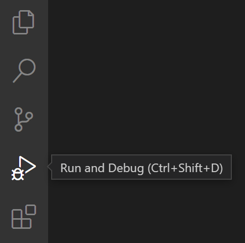

+++
title = 'Déboguer dans Visual Studio Code'
weight =  192
+++

## Extensions de débogage

VS Code prend en charge le débogage pour Node.js et peut déboguer JavaScript, TypeScript, et d'autres langages compilés en JavaScript. Pour d'autres langages et environnements d'exécution, il existe des extensions de débogage dans le Marketplace de VS Code.

Par exemple pour Python:

Le débogueur est un outil utile qui vous permet d'inspecter le flux d'exécution de votre code et d'identifier plus facilement les erreurs, ainsi que d'explorer comment vos variables et données changent au fur et à mesure que votre programme s'exécute. 

Vous pouvez commencer le débogage en définissant un point d'arrêt dans votre projet Python en cliquant dans la marge à côté de la ligne que vous souhaitez inspecter.

## Les points d'arrêt

{}
Un point d’arrêt est un marqueur que vous placez dans votre code pour indiquer au débogueur où arrêter l’exécution du programme. Cela vous permet d’inspecter l’état de votre application à ce moment précis, de vérifier les valeurs des variables et de suivre le flux d’exécution du code.
{}

### Ajout de points d'arrêt

Cliquez dans la marge gauche à côté d'une ligne de code. Vous pouvez également sélectionner la ligne et appuyer sur `F9`, sélectionner `Déboguer > Basculer le point d'arrêt`, ou faire un clic droit et sélectionner `Point d'arrêt > Insérer un point d'arrêt`. 

Le point d'arrêt apparaît sous forme de point rouge dans la marge gauche.

Lorsque vous déboguez, une fois que votre programme atteint le point d'arrêt, **l'exécution s'arrête au point d'arrêt, avant que le code sur cette ligne ne soit exécuté**. Vous pourrait alors suivre les données dans la console de débogage Python, et de progresser dans votre programme en utilisant la barre d'outils de débogage.

Voici quelques instructions générales pour travailler avec les points d'arrêt.

- Le point d'arrêt est un bascule. Vous pouvez cliquer dessus, appuyer sur `F9`, ou utiliser `Déboguer > Basculer le point d'arrêt` pour le supprimer ou le réinsérer.
- Pour désactiver un point d'arrêt sans le supprimer, survolez-le ou faites un clic droit dessus, et sélectionnez `Désactiver le point d'arrêt`. Les points d'arrêt désactivés apparaissent sous forme de points vides dans la marge gauche ou la fenêtre des points d'arrêt. Pour réactiver un point d'arrêt, survolez-le ou faites un clic droit dessus, et sélectionnez `Activer le point d'arrêt`.

## Interface utilisateur du débogueur

- **Vue Exécuter et Déboguer** : Affiche toutes les informations liées à l'exécution et au débogage.
- **Barre d'outils de débogage** : Contient des boutons pour les actions de débogage courantes.
- **Console de débogage** : Permet de voir et d'interagir avec la sortie de votre code en cours d'exécution.
- **Barre latérale de débogage** : Permet d'interagir avec la pile d'appels, les points d'arrêt, les variables et les variables surveillées.

## Démarrer le débogage

Pour commencer le débogage, initialisez le débogueur en appuyant sur `F5`. Comme c'est la première fois que vous déboguez ce fichier, un menu de configuration s'ouvrira, vous permettant de sélectionner le type d'application que vous souhaitez déboguer. S'il s'agit d'un script Python, vous pouvez sélectionner **Fichier Python** ou **Bloc-notes Jupyter**.

**Vue Exécuter et Déboguer** : Sélectionnez l'icône Exécuter et Déboguer dans la barre d'activité ou utilisez le raccourci clavier `⇧⌘D` (Windows, Linux `Ctrl+Shift+D`).

## Actions de débogage

Une fois qu'une session de débogage commence, la barre d'outils de débogage apparaîtra en haut de l'éditeur. 

[barre menu](./toolbar.png)

| Action            | Raccourci       | Explication                                                                                       |
|-------------------|-----------------|---------------------------------------------------------------------------------------------------|
| Continue / Pause  | F5              | **Continue** : Reprendre l'exécution normale du programme/script (jusqu'au prochain point d'arrêt). **Pause** : Inspecter le code en cours d'exécution à la ligne actuelle et déboguer ligne par ligne. |
| Step Over         | F10             | Exécuter la méthode suivante comme une seule commande sans inspecter ou suivre ses étapes internes. |
| Step Into         | F11             | Entrer dans la méthode suivante pour suivre son exécution ligne par ligne.                         |
| Step Out          | Shift+F11       | Lorsqu'on est dans une méthode ou une sous-routine, revenir au contexte d'exécution précédent en exécutant les lignes restantes de la méthode actuelle comme une seule commande. |
| Restart           | Ctrl+Shift+F5   | Terminer l'exécution actuelle du programme et recommencer le débogage en utilisant la configuration de lancement actuelle. |
| Stop              | Shift+F5        | Terminer l'exécution actuelle du programme.                                                       |

---

## Références

[Deboguer dans VS Code](https://code.visualstudio.com/docs/editor/debugging)

[Deboguer du Python dans VS Code](https://code.visualstudio.com/docs/python/debugging)

[Guide de démarrage rapide pour Python dans VS Code](https://code.visualstudio.com/docs/python/python-quick-start)
