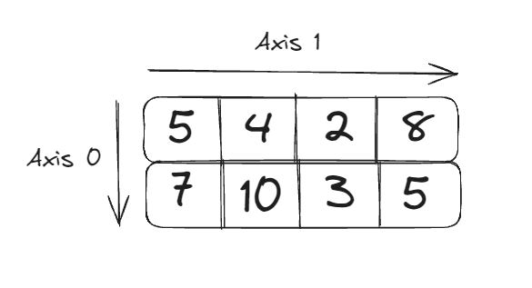
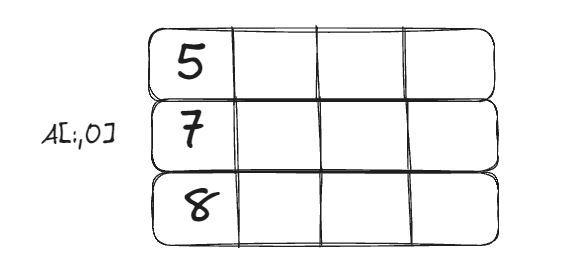
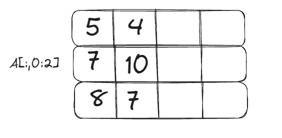
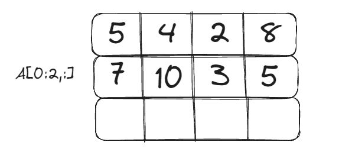
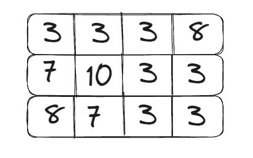
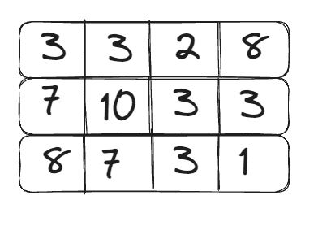

+++
title = "NumPy OLD"
weight = 131
+++


## Qu'est-ce que NumPy?

NumPy, ou *Numerical Python*, est une bibliothèque essentielle pour le calcul scientifique en Python. Elle permet de travailler efficacement avec des tableaux multidimensionnels et offre une large gamme de fonctions mathématiques pour effectuer des opérations sur ces tableaux. 

NumPy permet de :
- Manipuler des données de manière efficace.
- Effectuer des opérations mathématiques et statistiques avancées.
- Travailler avec des données multidimensionnelles.
- Intégrer facilement avec d'autres bibliothèques et outils de data science.


## Utilisation de NumPy

Pour commencer, vous devez importer dans votre script Python :

```python
import numpy as np
```

Pour vérifier que NumPy est bien installé sur votre environnement :

```python
# Version de NumPy
np.__version__
```
Vous devriez voir la version installée sous la forme de 1.XX.X. Si tel n’est pas le cas, il faudra installer Numpy comme ceci :

```
pip install numpy
```

## Les bases de NumPy

### Les tableaux NumPy

Un tableau NumPy (ou `ndarray` pour *n-dimensional array*) est une grille de valeurs, toutes du même type, et est indexée par un tuple de nombres non négatifs. 
Les dimensions d'un tableau sont appelées axes.

Tout comme nous avons créé des listes en Python, il est possible de créer des tableaux avec Numpy. La différence réside dans la rapidité de traitement lorsqu'il s'agit de travailler avec des données en grande quantité.
En effet, Numpy a été développé de sorte que les calculs soient plus rapides.

Ici, nous allons manipuler des tableaux à 1 et 2 dimensions.


#### Création de tableaux

**Tableau à 1 dimension : np.array()**

```python
# Tableau à une dimension
tab_1d = np.array([5, 4, 2, 8])
print(tab_1d)
```


**Tableau à 2 dimensions : np.array()**

```python
# Tableau à deux dimension
tab_2d = np.array([[5, 4, 2, 8],[7, 10, 3, 5][8, 7, 4, 1]])
print(tab_2d)
```


**D'autres créations de tableaux : np.array()**

```python
# À partir d'une liste
tab_liste = np.array([1, 2, 3])
print(tab_liste) # Affiche 

# Tableaux de zéros et de uns
tab_zeros = np.zeros((2, 3))
print(tab_zeros) # Affiche

tab_uns = np.ones((2, 3))
print(tab_uns) # Affiche

# Tableau vide (initialisé avec des valeurs aléatoires proches de zéro) :
tab_vide = np.empty((2, 3))
print(tab_vide) # Affiche par exemple

# Tableau avec une plage de valeurs
tab_plage = np.arange(0, 10, 2)
print(tab_plage) # Affiche 

# Tableau avec des valeurs espacées linéairement
tab_espace = np.linspace(0, 1, 5)
print(tab_espace) # Affiche
```

Vous pouvez également convertir le type de données d'un tableau existant :

```python
tab_converti = tab_liste.astype(np.float64)
print("Tableau converti en flottants:", tab_converti) # Affiche 
```

### La **forme**, la **taille** et la **dimension** d'un tableau

Les tableaux NumPy ont plusieurs attributs importants :

- `shape` : les formes du tableau.
- `size` : le nombre total d'éléments (taille) dans le tableau.
- `ndim` : le nombre d'axes (dimensions) du tableau.

Pour connaître la forme de notre tableau :
```python
# Retourne la forme du tableau
np.shape(tab_2d) # Affiche (3, 4). Notre tableau comporte 2 lignes et 4 colonnes.
```

Pour connaître la taille de notre tableau :
```python
# Retourne la forme du tableau
np.size(tab_2d) # Affiche 12 comme le nombre d'éléments de notre tableau
```

Pour connaître la dimension de notre tableau :
```python
# Retourne la forme du tableau
np.ndim(tab_2d) # Affiche 2 comme le nombre de dimensions de notre tableau
```

### Accès aux éléments et découpage (*Slicing*) du tableau

L'indexation et le *slicing* sont des opérations essentielles pour manipuler les tableaux NumPy. 

#### 1. Accès indicé

Comme tous tableaux, il est possible d'accéder aux éléments à l'aide des **index**.

- Pour notre tableau à 1 dimension, rien de plus simple :
```python
# Accès au premier élément
tab_1d[0] # Affiche 5
tab_1d[2] # Affiche 2
```

- Pour notre tableau à 2 dimensions, ils existent bien plus d'éléments à savoir :
```python
# Accès à la première ligne
print(tab_2d[0]) # Affiche [5 4 2 8]
```

De ce fait, si je souhaite accéder à la première "case" de mon tableau :

```python
# Accès au premier élément de notre tableau à 2 dimensions
print(tab_2d[0][0]) # Affiche 5
```

####  2. Découpage du tableau

Il faut savoir qu'un tableau comporte des **axes** (axis).



Nous avons vu que lorsque nous utilisons la fonction shape(), le premier élément correspond aux lignes et le deuxième aux colonnes du tableau.
De ce fait, l'axe 0 correspond aux lignes et l'axe 1 aux colonnes de mon tableau.


```python
print(tab_2d[:, 0]) # Affiche [5 7 8] soit la première colonne
```



```python
print(tab_2d[0, :]) # Affiche [5 4 2 8] soit la première ligne
```


```python
print(tab_2d[:, 0:2]) # # Affiche [[5 4][7 10][8 7]]
```



```python
print(tab_2d[0:2, :]) # Affiche [[5 4 2 8][7 10 3 5]]
```



#### 3. Indexation booléenne

L'indexation booléenne consiste à interroger notre tableau pour qu'il nous retourne "Vrai" ou "Faux" sous la forme d'un masque booléen. Par la suite, nous pourrons effectuer des modifications basées sur celui-ci.

```python
print(tab_2d < 7)
```
```python
[[ True  True  True False]
 [False False  True  True]
 [False False  True  True]]
```

A partir de ce masque, je peux modifier toutes les valeurs de ce tableau qui sont inférieures à 7 et les remplacer par des valeurs égales à 3.

```python
tab_2d[tab_2d < 7] = 3
print(tab_2d)
```




Il est aussi possible d'effectuer des tests multiples.

```python
tab_2d = np.array([[5, 4, 2, 8],[7, 10, 3, 5][8, 7, 4, 1]])
tab_2d[(tab_2d < 7) & (tab_2d > 3)] = 3
print(tab_2d)
```



## Opérations mathématiques et statistiques sur les tableaux

NumPy permet d'effectuer des opérations arithmétiques et statistiques directement sur les tableaux :

### Mathématiques

####  1. Somme

```python
tab_2d = np.array([[5, 4, 2, 8],[7, 10, 3, 5][8, 7, 4, 1]])
np.sum(tab_2d) # Affiche 64
```

Il est possible de calculer la somme en fonction d'un axe.

```python
np.sum(tab_2d, axis=0) # Affiche [20, 21,  9, 14] soit la somme des colonnes
```

```python
np.sum(tab_2d, axis=1) # Affiche [19, 25, 20] soit la somme des lignes
```

Cette technique pourra être utilisée pour les fonctions suivantes.

#### 2. Produit

```python
np.prod(tab_2d) # Affiche 75264000
```

####  3. Sinus

```python
np.sin(tab_2d)
```

```python
[[-0.95892427, -0.7568025 ,  0.90929743,  0.98935825],
[ 0.6569866 , -0.54402111,  0.14112001, -0.95892427],
[ 0.98935825,  0.6569866 , -0.7568025 ,  0.84147098]]
```

####  4. Exponentiel

```python
np.exp(tab_2d)
```

```python
[[1.48413159e+02, 5.45981500e+01, 7.38905610e+00, 2.98095799e+03],
[1.09663316e+03, 2.20264658e+04, 2.00855369e+01, 1.48413159e+02],
[2.98095799e+03, 1.09663316e+03, 5.45981500e+01, 2.71828183e+00]]
```

### Statistiques

####  1. Moyenne

```python
np.mean(tab_2d) # Affiche 5.33
```

####  2. Médiane

```python
np.median(tab_2d) # Affiche 5
```


####  3. Variance

```python
np.var(tab_2d) # Affiche 6.722222222222222
```


####  4. Ecart type

```python
np.std(tab_2d) # Affiche 2.592724864350674
```

####  5. Coefficient de corrélation

```python
np.mean(tab_2d)
```

```python
[[ 1.        ,  0.1004662 , -0.46380072],
[ 0.1004662 ,  1.        ,  0.63540406],
[-0.46380072,  0.63540406,  1.        ]]
```
## Fonctions diverses

###  1. Valeurs uniques

La fonction suivante permet de retourner les valeurs uniques de notre tableaux et de compter le nombre d'occurrences de ces valeurs.

```python
np.unique(tab_2d, return_counts=True)
```

```python
array([ 1,  2,  3,  4,  5,  7,  8, 10]),
array([1, 1, 1, 2, 2, 2, 2, 1], dtype=int64)
```

### 2. Importer un jeu de données

Dans la majorité des cas, vous travaillerez avec des données qui vous seront fournies.
Ils existent des fonctions qui vous permettent de charger ces données.

Voici un exemple avec un fichier contenant des données météo très simplifiées réparties sur 7 jours.

```python
data = np.loadtxt("data.csv", delimiter=',', skiprows=1)
print(data)
```

Les arguments à passer sont :
- le nom du fichier
- le délimiteur (à vérifier en ouvrant votre fichier)
- étant donné que notre première ligne est composée de caractère, nous faisons abstraction de celle-ci. Numpy ne prend pas en charge la gestion des données numériques.

```python
[[ 1  0 10]
 [ 2  0  8]
 [ 3  5  3]
 [ 4  2  5]
 [ 5 10  1]
 [ 6 50  0]
 [ 7  0 10]]
```

Nous retrouvons notre tableau à deux dimensions avec les données chargées dans notre variable data.

## Liste non exhaustive de fonctions

Numpy est doté d'une grande quantité de fonction permettant de gérer des tableaux.

| Fonctions |  |
| ---- | ----|
| `array()` | Crée un tableau |
| `shape()` | Retourne la forme du tableau |
| `ndim()` | Retourne le nombre de dimension du tableau |
| `size()` | Retourne le nombre d'éléments dans le tableau |
| `zeros()` | Crée un tableau composé uniquement de 0 |
| `ones()` | Crée un tableau composé uniquement de 1 |
| `arange()` | Génère un tableau avec une suite de nombre en fonction du pas saisi |
| `linspace()` | Génère un tableau avec une suite de nombre en fonction de la quantité saisie |
| `random.randn()` | Génère un tableau avec des nombres basés sur la loi normale centrée réduite |
| `sum()` | Retourne la somme |
| `prod()` | Retourne le produit |
| `mean()` | Retourne la moyenne |
| `median()` | Retourne la médiane |
| `var()` | Retourne la variance |
| `std()` | Retourne l'écart type |
| `corrcoef()` | Retourne la corrélation entre les différentes variables |
| `sort()` | Tri le tableau |
| `min()` | Retourne la valeur minimum |
| `max()` | Retourne la valeur maximum |
| `argmin()` | Retourne l'indice de la valeur minimum |
| `argmax()` | Retourne l'indice de la valeur maximum |

Pour plus de fonctions : [Site officiel Numpy](https://numpy.org/doc/stable/index.html "Numpy").


## Atelier

[La bibliothèque NumPy](../atelier-numpy.ipynb)